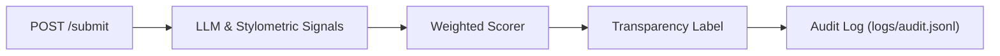

# Provenance Guard

Provenance Guard is an API backend designed to classify text as human or AI-generated for creative writing platforms. It calculates a confidence score, maps it to a transparency label, and provides an appeals endpoint to manage misclassifications.

## File Structure

```text
.
├── app.py              # Main Flask application and API routes
├── auditor.py          # Audit log management
├── config.py           # Environment and configuration variables
├── detector.py         # Main detector pipeline orchestrator
├── labeler.py          # Logic for mapping scores to transparency labels
├── scorer.py           # Weighted combination logic for signal scores
├── stylometrics.py     # Pure Python stylometric heuristics (SLV, TTR, PD)
├── logs/               # Audit log storage
└── testing/            # Bash scripts and test outputs
```

## Architecture Overview

When text is submitted to `POST /submit`, it is processed by two detection functions: a Groq LLM classifier and a custom Python stylometric analyzer. Both return a score (0.0 to 1.0) which are combined into a weighted confidence score. This score maps to a transparency label. The results are logged to an audit file and returned to the user.

For appeals (`POST /appeal`), the system finds the entry in the audit log, changes its status to `"under_review"`, and attaches the creator's reasoning. No automated re-classification occurs; it simply flags the entry for human review.



## Detection Signals

**Signal 1: LLM Classification (Groq: llama-3.3-70b-versatile)**
- **What it measures:** Semantic and stylistic coherence (e.g., natural irregularity, personal voice, idiomatic expressions).
- **Why it was chosen:** AI text is statistically consistent and maintains a rigid tone. LLMs recognize these structural and semantic patterns well.
- **Blind spots:** Formal writing (academic/legal), intentionally polished writing, and non-native English speakers.

**Signal 2: Stylometric Heuristics (Pure Python)**
- **What it measures:** Sentence Length Variance (SLV), Type-Token Ratio (TTR), and Punctuation Density (PD).
- **Why it was chosen:** AI text lacks natural variance. This provides a measurable, structural counter-balance to the semantic LLM check.
- **Blind spots:** Poetry/experimental writing, simple repetitive human writing, and short text (< 50 words).

## Confidence Scoring

**Formula:** `confidence = (0.60 × llm_score) + (0.40 × stylo_score)`
The LLM signal carries more weight because it captures semantic meaning. Stylometrics acts as corroborating evidence. 

**Thresholds:**
- `≥ 0.70` : `likely_ai`
- `0.36 - 0.69` : `uncertain`
- `≤ 0.35` : `likely_human`

### Validation Examples

- **High-Confidence AI:** "Artificial intelligence represents a transformative paradigm shift in modern society. It is important to note that while the benefits of AI are numerous, it is equally essential to consider the ethical implications." (Score: 0.7063 / 71%)
- **Lower-Confidence (Human):** "ok so i finally tried that new ramen place downtown and honestly? underwhelming. the broth was fine but they put WAY too much sodium in it and i was thirsty for like three hours after." (Score: 0.277 / 28%)

## Transparency Labels

| Attribution | Display Text |
|---|---|
| **High-Confidence AI** | ⚠️ **AI-Generated Content**<br>Our analysis indicates this content was likely generated by an AI system (confidence: 71%). If you are the creator and believe this is incorrect, you may submit an appeal. |
| **High-Confidence Human** | ✅ **Human-Authored Content**<br>Our analysis indicates this content was likely written by a human (confidence: 28% human). No further action required. |
| **Uncertain** | 🔍 **Authorship Uncertain**<br>Our analysis could not determine with confidence whether this content was written by a human or generated by AI (confidence: 48%). No action has been taken. |

## Rate Limiting

- **10 requests per minute per IP:** Enough headroom for any normal user while stopping rapid automated spam.
- **100 requests per day per IP:** Generous for a single person but makes automated bulk runs impractical.

## Anticipated Edge Cases (Known Limitations)

1. **Formal human writing (academic/legal):** Highly structured text may cause both signals to over-score it as AI. These will likely land in the "uncertain" band, which is preferable to a confident mislabeling.
2. **Short text (< 50 words):** Stylometrics break down because meaningful sentence variance cannot be computed from just a few sentences.
3. **Non-native English speakers:** Formal grammatical patterns can mimic AI output. This is why the "uncertain" band is wide and the appeals process is necessary.

## Spec Reflection

- **How the spec helped:** Defining exact JSON payloads in `planning.md` eliminated guesswork when building the Flask routes.
- **How it diverged:** The original spec weighted the stylometric heuristics at SLV 40%, TTR 40%, and PD 20%. During testing, TTR scores hovered between 0.10 and 0.14 across all inputs, pulling scores artificially toward the middle. I updated the implementation to reduce TTR to 20% and raised SLV to 55%.

## AI Usage

1. **Testing Scripts:** I directed the AI to write bash scripts (`test_m4.sh`, `test_m5_labels.sh`, `test_m5_appeals.sh`, and `test_m5_ratelimit.sh`) to automate testing endpoints.
2. **Debugging Stylometrics Weights:** I used the AI to help debug why the confidence scores were bunching in the middle. I suggested adjusting the weights to resolve the issue, and the AI helped me decide exactly how much to adjust each metric if I lowered TTR.
