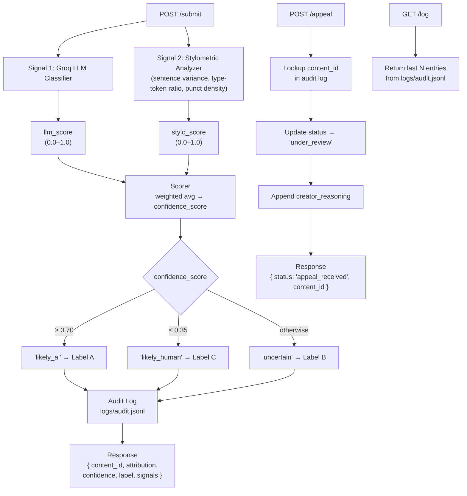

# Provenance Guard — Planning Document

## Architecture Narrative

When someone submits text to `POST /submit`, it gets run through two separate detection
functions at the same time. The first one is a Groq LLM classifier — it looks at the
writing semantically and basically asks "does this read like a human or an AI wrote it?"
The second is a stylometric analyzer I built in pure Python, which checks measurable
things like how much sentence length varies, how diverse the vocabulary is (type-token
ratio), and how dense the punctuation is. Both functions return a score from 0.0 to 1.0,
and those get blended into a single confidence score using a weighted average. From there,
the score maps to one of three labels. Everything gets logged to an audit file, and the
response sends back the content ID, the attribution result, the confidence score, and the
label.

The appeal flow is simpler. When a creator hits `POST /appeal` with their `content_id`
and an explanation, the system finds that entry in the audit log, flips the status to
`"under_review"`, and attaches their reasoning. It sends back a confirmation. I'm not
doing any automated re-classification here — the point is that a human reviewer would
look at flagged entries, not the system itself.

---

## Architecture



---

## Detection Signals

### Signal 1 — LLM Classification (Groq: llama-3.3-70b-versatile)

**What it measures:** Semantic and stylistic coherence. The LLM assesses whether the
writing reads as human-generated based on patterns the model recognizes from its training:
natural irregularity, personal voice, imperfect grammar, idiomatic expressions, and
contextual authenticity.

**Output:** A float from 0.0 (very likely human) to 1.0 (very likely AI).

**Why AI writing differs:** AI text is almost too clean. It's well-structured, it doesn't
really contradict itself, and it doesn't have the kind of messiness that actual human
writing has. The tone stays weirdly consistent all the way through, which is actually one
of the things the LLM picks up on.

**Blind spots:**
- Formal writing like academic papers or legal documents is going to be a problem — it's
  structured and clean in the same way AI is, so the LLM might over-score it.
- If someone is a really polished writer who writes cleanly on purpose, they might get
  flagged. Not much I can do about that with this approach.
- Non-native English speakers are a real concern. Their writing patterns sometimes look
  like AI output even when they're not.

---

### Signal 2 — Stylometric Heuristics (Pure Python)

Three sub-metrics, each normalized to 0.0–1.0:

**a) Sentence Length Variance (SLV):**
Measures how much sentence lengths vary throughout the text.
- High variance → human-like (score approaches 0.0)
- Low variance → AI-like (score approaches 1.0)
- Formula: normalize stddev of sentence word counts; invert so high variance = low AI score

**b) Type-Token Ratio (TTR):**
Measures vocabulary diversity (unique words / total words).
- High TTR → diverse vocabulary → human-like (score approaches 0.0)
- Low TTR → repetitive vocabulary → AI-like (score approaches 1.0)

**c) Punctuation Density (PD):**
Measures punctuation marks per word.
- Human writing uses varied punctuation (em-dashes, ellipses, exclamations)
- AI writing uses fewer, more "standard" punctuation marks
- Very low punctuation density can signal AI

**Combined stylo_score:** Weighted average — SLV (40%) + TTR (40%) + PD (20%)

**Why AI writing differs:** LLMs generate text with statistically consistent sentence
patterns. They don't naturally vary their cadence the way humans do when writing freely.
Vocabulary in AI output is also more "model-characteristic" — it favors certain words and
structures that appear frequently in training data.

**Blind spots:**
- Poetry and experimental writing have intentionally irregular structure; they may score as
  "human" even if AI-generated because of high structural variance.
- Simple, repetitive human writing (social media posts, quick notes) may resemble AI output.

---

## Confidence Scoring

**Formula:** `confidence = (0.6 × llm_score) + (0.4 × stylo_score)`

The LLM signal carries more weight (60%) because it captures semantic meaning — something
stylometrics cannot. Stylometrics is treated as corroborating evidence.

**Thresholds:**

| Score Range | Attribution     | Meaning                                          |
|-------------|-----------------|--------------------------------------------------|
| ≥ 0.70      | `likely_ai`     | Both signals strongly suggest AI authorship      |
| 0.36 – 0.69 | `uncertain`     | Signals are ambiguous or disagree                |
| ≤ 0.35      | `likely_human`  | Both signals suggest human authorship            |

**Why these thresholds?**
I set the `likely_ai` threshold high at 0.70 because a false positive is way worse than
a false negative here — if the system wrongly flags a human creator's work as AI, that
actually hurts someone. Better to land in "uncertain" than to make a wrong confident call.
The uncertain band being wide (0.36–0.69) is intentional too — I'd rather the system admit
it doesn't know than guess and be wrong.

---

## Transparency Labels

These are the exact strings returned in the API response and displayed to users.

**Label A — High-confidence AI (`attribution: likely_ai`, confidence ≥ 70%):**
```
⚠️ AI-Generated Content
Our analysis indicates this content was likely generated by an AI system
(confidence: {score}%). If you are the creator and believe this is incorrect,
you may submit an appeal.
```

**Label B — Uncertain (`attribution: uncertain`, confidence 36–69%):**
```
🔍 Authorship Uncertain
Our analysis could not determine with confidence whether this content was
written by a human or generated by AI (confidence: {score}%). No action
has been taken.
```

**Label C — High-confidence Human (`attribution: likely_human`, confidence ≤ 35%):**
```
✅ Human-Authored Content
Our analysis indicates this content was likely written by a human
(confidence: {score}% human). No further action required.
```

---

## Appeals Workflow

**Who can appeal:** Any creator who has the `content_id` from their original submission.

**What they provide:** `content_id` (string) + `creator_reasoning` (string, their explanation).

**What happens when an appeal is received:**
1. The system looks up the original audit log entry by `content_id`.
2. The entry's `status` field is updated from `"classified"` to `"under_review"`.
3. The `appeal_reasoning` field is added to the entry.
4. An `appeal_timestamp` is recorded.
5. A confirmation response is returned to the caller.

**What a human reviewer would see:** The `GET /log` endpoint returns all entries including
updated ones. A reviewer would filter for `"status": "under_review"` to find pending appeals.

**No automated re-classification** is performed.

---

## Rate Limiting

**Endpoint limited:** `POST /submit` only. Appeal and log endpoints are not rate-limited.

**Limits:**
- 10 requests per minute per IP
- 100 requests per day per IP

**Reasoning:** A real creator submitting their own work isn't going to send 10 requests a minute — that's
already way more than normal. 10/min is enough headroom for anyone using the app legitimately
while still stopping bots. 100/day is generous for a single person but would make any kind
of automated bulk run impractical.

---

## Anticipated Edge Cases

1. **Formal human writing (academic/legal):** This one worries me a little. Academic and
   legal writing is so structured that both signals might call it AI even when it's not. I'd
   expect something like a research paper to land around 0.55–0.65 and get the "uncertain"
   label. I think that's actually fine — it's more honest than confidently mislabeling it.

2. **Short text (< 50 words):** The stylometric signal basically breaks down here. You can't
   compute meaningful sentence variance from two or three sentences. I want the system to
   catch this and flag it in the response so the confidence score isn't taken at face value.

3. **Non-native English speakers:** Both signals could misfire here pretty easily — formal
   grammatical patterns look a lot like AI output. This is honestly the biggest reason I
   wanted the uncertain band to be wide and the appeal process to be low-friction.

---

## AI Tool Plan

### M3 — Submission endpoint + Signal 1
- **Spec sections provided:** Detection signals (Signal 1) + Architecture diagram
- **What to generate:** Flask app skeleton with `POST /submit` route stub + Groq signal function
- **Verification:** Call the Groq function directly with 2–3 test inputs; inspect the raw
  score before wiring into the endpoint

### M4 — Signal 2 + Confidence scoring
- **Spec sections provided:** Both detection signal sections + Uncertainty representation + Architecture diagram
- **What to generate:** Stylometric signal function + scoring/weighting logic
- **Verification:** Run all 4 test inputs from the spec; confirm clearly-AI text scores ≥ 0.70
  and clearly-human text scores ≤ 0.35

### M5 — Production layer
- **Spec sections provided:** Transparency label section + Appeals workflow + Architecture diagram
- **What to generate:** Label generation function + `POST /appeal` endpoint + Flask-Limiter setup
- **Verification:** Confirm all 3 label variants are reachable; submit an appeal and check
  `GET /log` shows `"status": "under_review"`